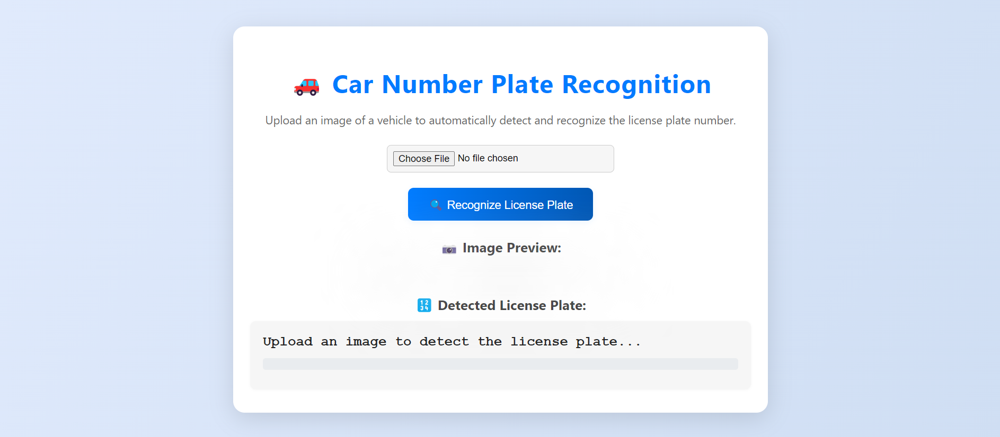
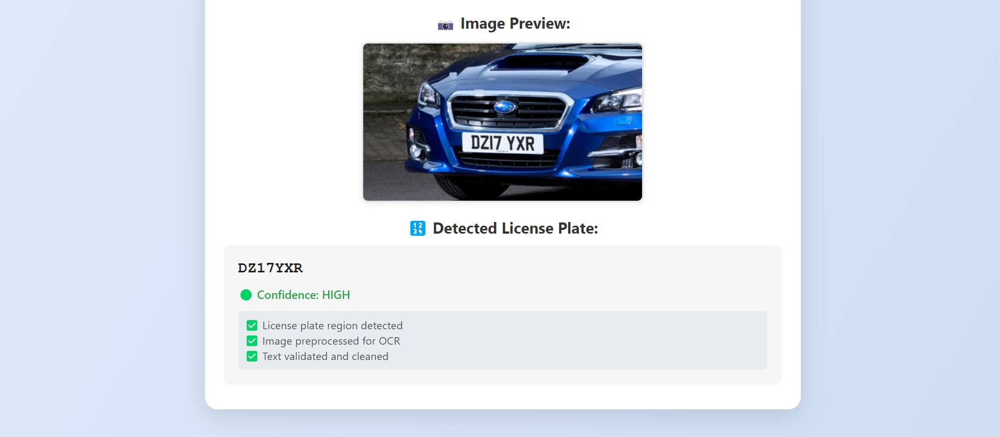
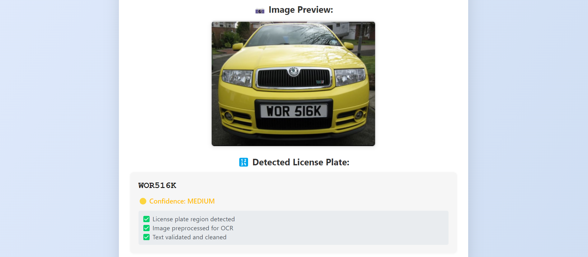

# Automatic Car Number Plate Recognition System

An **advanced, high-accuracy** image processing system that uses computer vision and OCR (Optical Character Recognition) to automatically detect and recognize vehicle license plates from images with improved accuracy and robustness.

## � Table of Contents

- [Latest Improvements](#-latest-improvements-v20)
- [Screenshots](#-screenshots)
- [Quick Demo](#-quick-demo)
- [Features](#features)
- [System Architecture](#system-architecture)
- [Installation](#installation)
- [Usage](#usage)
- [Technical Details](#technical-details)
- [Applications](#applications)
- [Performance Optimization](#performance-optimization)
- [Troubleshooting](#troubleshooting)
- [Future Enhancements](#future-enhancements)
- [Dependencies](#dependencies)
- [License](#license)

## 🚀 Latest Improvements (v2.0)

### Enhanced Detection Accuracy
- **Multi-method Detection**: Combines Haar cascades, edge detection, and MSER for better plate localization
- **Advanced Preprocessing**: 6 different image enhancement techniques including CLAHE and denoising
- **Smart OCR**: 8 different Tesseract configurations with optimal parameters
- **Multiple Attempts**: Tries enhanced image, original image, and different regions automatically
- **Confidence Scoring**: Advanced scoring system considering method, preprocessing, and text patterns

### Improved Text Recognition
- **Optimal Sizing**: Automatically resizes images to optimal OCR dimensions (32-48px height)
- **Pattern Validation**: Enhanced validation for various international license plate formats
- **OCR Error Correction**: Smart correction of common OCR errors (O/0, I/1, S/5, etc.)
- **Context-aware Processing**: Adapts correction based on expected character distribution

### Better Robustness
- **Graceful Degradation**: Falls back to alternative methods when primary detection fails
- **Regional Processing**: Tries center and bottom regions when full detection fails
- **Error Handling**: Comprehensive error handling with detailed logging
- **Performance Optimization**: Intelligent processing with time/accuracy balance

## 📸 Screenshots

### Web Interface

*User-friendly web interface for uploading vehicle images*

### Processing Results

*License plate detection with confidence scoring and detailed processing information*

### Multiple Detection Examples

*Example of successful license plate recognition on various vehicle types*

## 🎯 Quick Demo

1. **Upload**: Select an image containing a vehicle with a visible license plate
2. **Process**: The system automatically detects and extracts the license plate text
3. **Results**: View the recognized license plate number with confidence level and processing details

The system works with various vehicle types and license plate formats, providing reliable recognition even in challenging conditions.

## Features

- **Intelligent Plate Detection**: Uses multiple detection methods with confidence scoring
- **Advanced Image Preprocessing**: 6 different enhancement techniques for optimal OCR
- **Robust OCR**: Multiple OCR configurations for maximum text extraction accuracy
- **Smart Pattern Validation**: Validates against common license plate formats worldwide
- **Confidence Scoring**: Provides detailed confidence levels (high, medium, low)
- **Multi-attempt Processing**: Tries multiple approaches automatically for best results
- **Web Interface**: User-friendly web interface with detailed processing feedback
- **Real-time Processing**: Fast processing with intelligent method selection

## System Architecture

The system consists of several key components:

1. **Image Preprocessing Module**: Enhances image quality for better OCR results
2. **License Plate Detection**: Locates license plate regions in vehicle images
3. **OCR Engine**: Extracts text from detected license plates using Tesseract
4. **Text Validation**: Validates and cleans extracted text using pattern matching
5. **Web Interface**: Flask-based web application for user interaction

## Installation

### Prerequisites

1. **Python 3.7+** installed on your system
2. **Tesseract OCR** installed:
   - **Windows**: Download from [GitHub releases](https://github.com/UB-Mannheim/tesseract/wiki)
   - **Linux**: `sudo apt-get install tesseract-ocr`
   - **macOS**: `brew install tesseract`

### Setup

1. **Clone or download the project**:
   ```bash
   git clone https://github.com/shakiliitju/Car-Number-Plate-Recognition-System.git
   cd Car-Number-Plate-Recognition-System
   ```

2. **Create a virtual environment** (recommended):
   ```bash
   python -m venv venv
   
   # Windows
   venv\Scripts\activate
   
   # Linux/macOS
   source venv/bin/activate
   ```

3. **Install Python dependencies**:
   ```bash
   pip install -r requirements.txt
   ```

4. **Verify Tesseract installation**:
   ```bash
   tesseract --version
   ```

   **Note**: If you encounter "tesseract not found" error on Windows, you may need to add Tesseract to your system PATH or update the `app.py` file with the correct Tesseract executable path.

## Usage

### Running the Application

1. **Start the Flask server**:
   ```bash
   python app.py
   ```

2. **Open your web browser** and navigate to:
   ```
   http://localhost:5000
   ```

3. **Upload an image** containing a vehicle with visible license plate

4. **View results** including:
   - Detected license plate number
   - Confidence level
   - Processing steps information

### Supported Image Formats

- PNG, JPG, JPEG, GIF, BMP, TIFF
- Maximum file size: 16MB
- Recommended: Clear images with visible license plates

### Test Images

The project includes a comprehensive set of test images in the `test images/` folder with various vehicle types and license plate formats. These images can be used to test the system's accuracy and performance across different scenarios.

## Technical Details

### Image Processing Pipeline

1. **Image Resizing**: Large images are resized for optimal processing speed
2. **Grayscale Conversion**: Converts color images to grayscale
3. **Noise Reduction**: Applies Gaussian blur to reduce image noise
4. **Adaptive Thresholding**: Creates binary images for better text detection
5. **Morphological Operations**: Cleans up the binary image

### License Plate Detection Methods

1. **Haar Cascade Classification**: Uses pre-trained cascades when available
2. **Edge Detection**: Canny edge detection followed by contour analysis
3. **Aspect Ratio Filtering**: Filters contours based on typical license plate dimensions

### OCR Configuration

- Uses Tesseract OCR with multiple PSM (Page Segmentation Mode) configurations
- Character whitelist for alphanumeric characters only
- Multiple attempts with different configurations for better accuracy

### Pattern Validation

Supports various license plate formats:
- XX00XX0000 (2 letters, 2 numbers, 2 letters, 4 numbers)
- XXX000 (3 letters, 3 numbers)
- XXX0000 (3 letters, 4 numbers)
- 000XXX (3 numbers, 3 letters)
- And many more regional variations

## Applications

This ACNPR system can be used in various scenarios:

- **Traffic Management**: Monitor and track vehicles in traffic systems
- **Toll Collection**: Automated toll collection based on license plate recognition
- **Parking Automation**: Automatic entry/exit control in parking facilities
- **Law Enforcement**: Vehicle tracking and monitoring for security purposes
- **Access Control**: Restricted area access based on vehicle identification
- **Fleet Management**: Track company vehicles and logistics

## Performance Optimization

- **Image Resizing**: Automatically resizes large images for faster processing
- **Multi-method Detection**: Uses multiple detection algorithms for better accuracy
- **Efficient OCR**: Optimized OCR configurations for license plate text
- **Error Handling**: Robust error handling for various image types and qualities

## Troubleshooting

### Common Issues

1. **Tesseract not found error**:
   - Ensure Tesseract OCR is properly installed
   - Add Tesseract to your system PATH

2. **Poor recognition accuracy**:
   - Use high-quality, well-lit images
   - Ensure license plate is clearly visible and not obscured
   - Try images with minimal skew or rotation

3. **No license plate detected**:
   - Check if the license plate is clearly visible in the image
   - Try images with better contrast between plate and background
   - Ensure the license plate takes up a reasonable portion of the image

### Improving Accuracy

- Use images with good lighting conditions
- Ensure license plates are not tilted or skewed
- Clean license plates work better than dirty or damaged ones
- Higher resolution images generally provide better results

## 🧰 Debugging & Saved Uploads

When you upload an image the application saves a small set of debugging artifacts to help diagnose detection and OCR issues. This makes it much easier to inspect what the pipeline actually saw when Tesseract produced a wrong result.

- Location: `uploads/` (a new session folder is created for each upload)
- Folder naming: `Car Number-1`, `Car Number-2`, ... (sequential). If folder creation fails the app falls back to a UUID-named folder.

Files saved per session (summary):
- The original uploaded image (same filename you uploaded)
- `plate.png` — cropped plate region detected by the pipeline (if any)
- Detection images:
   - `sobel_combined.png` — combined Sobel edge map used for detection
   - `candidates_annotated.png` — annotated image showing all detection candidates and scores
   - `candidate_best_<score>.png` — cropped image of the top-scoring candidate
- Preprocessing images (one file each):
   - `bilateral.png`
   - `inverted.png`
   - `simple_otsu.png`
   - `morphological.png`

Notes:
- The system intentionally does NOT save OCR text output files (no `.txt` files are stored) to reduce persisted sensitive text.
- If a particular preprocessing method didn't produce a usable image it will be omitted from the session folder.

How to change or disable saving
- To change the uploads root folder, edit `app.config['UPLOAD_FOLDER']` in `app.py`.
- To stop saving debug artifacts, remove or comment out the lines in `app.py` that set `recognizer.debug_dir = session_dir` and the image-write sections inside the recognizer methods. The code is centralized so this is quick to toggle.
- If you prefer UUID folders instead of sequential `Car Number-N` folders, change the upload handler to use `uuid.uuid4().hex` for folder names (the code already falls back to this on error).

Privacy and cleanup
- The `uploads/` folder can grow over time. Periodically remove old `Car Number-*` folders or add a small cleanup script to keep recent N sessions.
- Avoid storing images from production with sensitive personal data for longer than necessary; implement a retention policy if deploying this system in production.

## Future Enhancements

- Support for multiple license plates in a single image
- Real-time video processing capabilities
- Integration with databases for vehicle tracking
- Support for more international license plate formats
- Machine learning models for improved detection accuracy

## Dependencies

### Core Libraries
- **Flask**: Web framework for the user interface
- **OpenCV (cv2)**: Computer vision library for image processing
- **Pytesseract**: Python wrapper for Tesseract OCR engine
- **NumPy**: Numerical computing library for array operations
- **Pillow (PIL)**: Python Imaging Library for image handling

### External Requirements
- **Tesseract OCR**: External OCR engine (must be installed separately)

### File Structure
```
Car-Number-Plate-Recognition-System/
├── app.py                 # Main Flask application
├── requirements.txt       # Python dependencies
├── README.md             # Project documentation
├── LICENSE               # License file
├── static/               # CSS and JavaScript files
│   ├── style.css
│   └── script.js
├── templates/            # HTML templates
│   └── index.html
├── screenshots/          # Demo screenshots
│   ├── 1.png
│   ├── 2.png
│   └── 3.png
├── test images/          # Sample test images
│   └── [Various car images]
└── uploads/              # Temporary upload directory
```

## License

This project is for educational and research purposes. Please ensure compliance with local laws and regulations when using for commercial applications involving vehicle monitoring or data collection.
